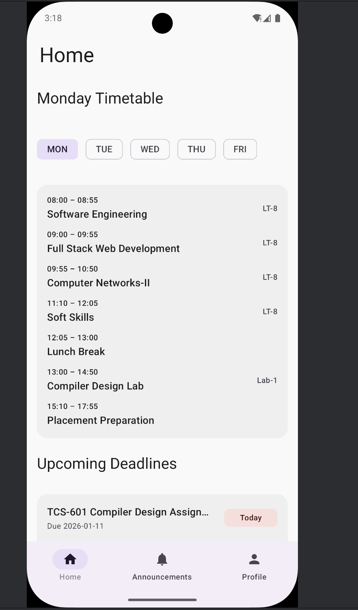
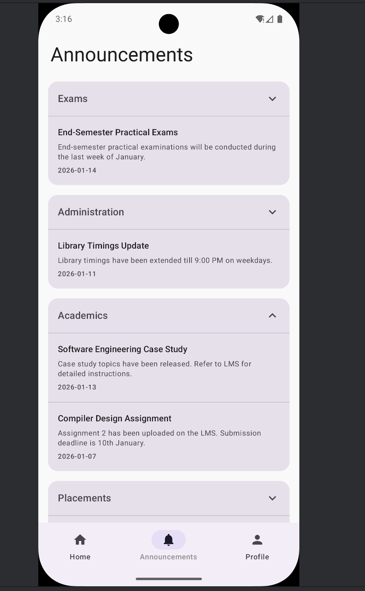
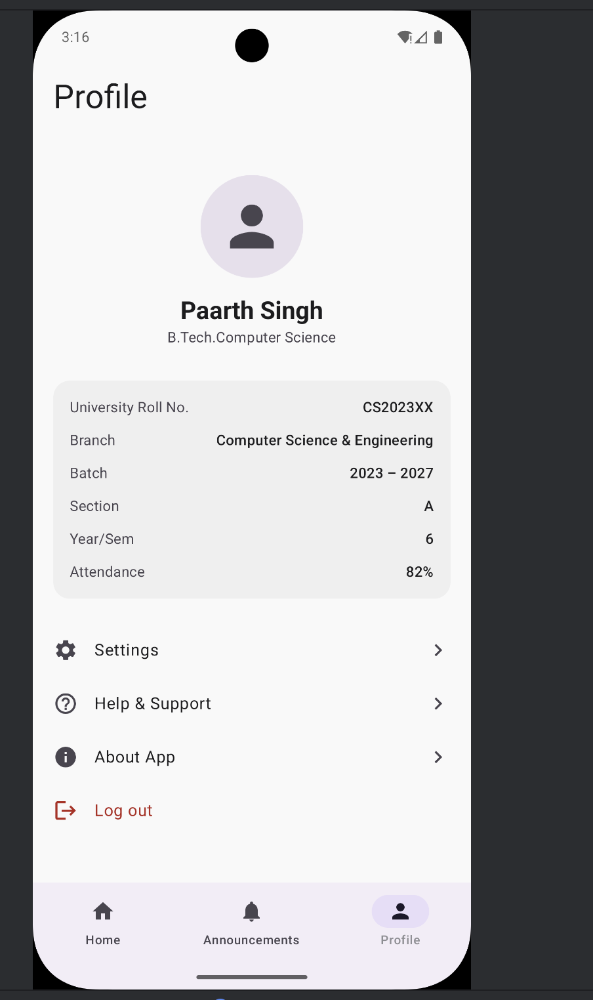
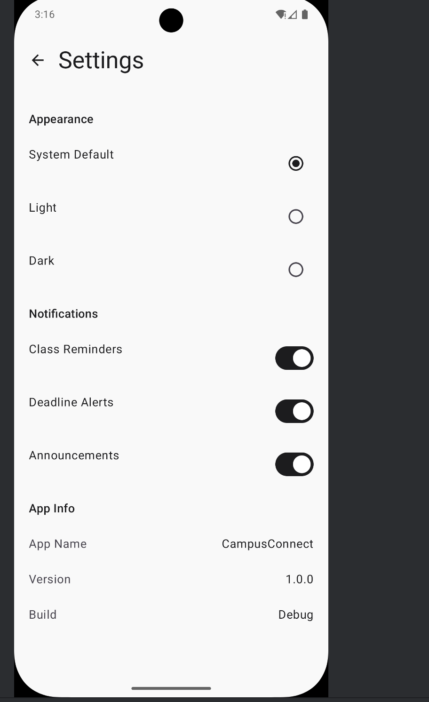
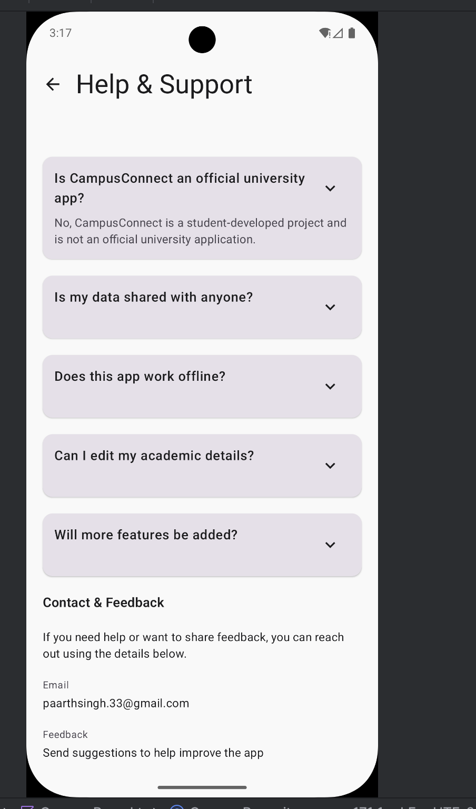
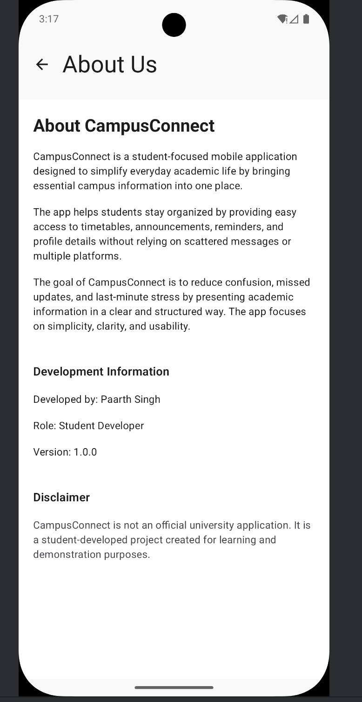

# CampusConnect

A Kotlin Multiplatform student companion app for managing academic life across Android and Desktop.

---

## Screenshots

<p align="center">
  
  
  
  
  
  
</p>

---

## About the Project

CampusConnect is a Kotlin Multiplatform application designed to simplify everyday academic life for university students by bringing essential campus information into one unified, offline-friendly app.

Students often receive academic updates through multiple disconnected channels such as notice boards, messaging apps, emails, and learning management systems. This fragmentation leads to missed deadlines, confusion, and unnecessary stress.

CampusConnect addresses this problem by consolidating core academic information into a single, easy-to-use application that works consistently across platforms.

> This is a student-developed project and is **not an official university application**.

## Motivation and Background 

I am currently a Third-year Computer Science student who enjoys learning by building things rather than only studying theory. My academic journey has introduced me to core programming concepts, but most of my learning has happened through hands-on experimentation, debugging, and improving projects over time. Writing code, breaking it, and fixing it again is something I genuinely enjoy.
App development is something I have interest in . I like working on applications where logic, design, and user experience come together. Outside of this project, I am also working on an iOS application as part of my personal learning process. . This experience made me curious about cross-platform solutions and eventually led me to explore Kotlin Multiplatform.

The idea for CampusConnect came from observing everyday problems in campus environments. Information related to classes, updates, or student activities is often scattered across different platforms, making communication inefficient. I wanted to explore whether a single, simple application could act as a common point for such interactions, even if only as a prototype.
This project was created specifically for the Kotlin Multiplatform Contest. The main goal was not to build a production-ready system, but to understand how shared business logic can be written once and reused across platforms while still allowing flexibility at the UI level. Kotlin Multiplatform felt like a natural choice because it encourages clean architecture and thoughtful separation of concerns.


---

## Features

### Authentication
- Simple login and logout flow for controlled app access

### Timetable
- Weekly timetable view
- Lectures, labs, lunch breaks, and placement preparation sessions

### Deadlines
- View upcoming academic deadlines with due dates

### Announcements
- Categorized announcements:
  - Academic  
  - Exam  
  - Administrative  
  - Placement  
  - Events  

### Appearance
- Light theme  
- Dark theme  
- System default  
- Applied globally across platforms

### Notification Preferences (UI-level)
- Class reminders  
- Deadline alerts  
- Announcement notifications  

### Help & Support
- Getting started guidance  
- Frequently asked questions  
- Common issue explanations  
- Contact and feedback information  

### About
- App purpose  
- Development details  
- Disclaimer  

---

## Kotlin Multiplatform Architecture

CampusConnect is built using **Kotlin Multiplatform** with a strong emphasis on **shared business logic and UI**, not just shared utilities.

Most of the application logic lives in the shared module, ensuring maximum code reuse and consistent behavior across platforms.

### Shared (`commonMain`)
- Data models (Timetable, Announcements, Deadlines, Profile)
- Repository layer
- Authentication state
- Theme state management
- Shared Compose UI screens
- Business logic and state handling

### Platform-specific
- **Android (`androidMain`)**  
  Android application entry point

- **Desktop (`jvmMain`)**  
  Desktop application entry point (macOS, Windows, Linux)

This architecture enables:
- High code reuse  
- Platform parity  
- Clean separation of concerns  

---

## Supported Platforms

- Android  
- Desktop (macOS, Windows, Linux)

The same shared codebase powers both platforms.

---

## Tech Stack

- Kotlin Multiplatform  
- Jetpack Compose Multiplatform  
- Material 3  
- Kotlinx Datetime  
- Gradle  

---

## How to run

### Prerequisites
- JDK 17 or higher  
- Android Studio (latest stable)  
- Android Emulator or physical Android device  

---

### Run on Android

Clone the Repository 

```bash
git clone https://github.com/Paarth2006/CampusConnect.git
```
1. Open the project in Android Studio

2. Select the Android run configuration

3. Click Run

### Run on Desktop (macOS / Windows / Linux)

1. Open the project in Android Studio

2. Select the Desktop / JVM run configuration

3. Click Run

## Demo

Watch the demo video to get a gist of the app working 

https://github.com/Paarth2006/Campus_Connect/blob/main/App_demo_video.mp4

## Author

Paarth Singh 

Student Developer

B.Tech Computer Science 

Graphic Era University , Dehradun , Uttarakhand , India 

## Notes

This project was created specifically for the KotlinConf Student Coding Competition.

The focus of this submission is correct and meaningful use of Kotlin Multiplatform, not backend services.

All data is currently stored locally and the application works offline.

The architecture is intentionally designed to be extendable for persistence, synchronization, and real authentication in the future.

## Future Steps

Database Integration

API Layer & Networking

AI Integration 

    1. Smart Announcement Summaries : Use an LLM API to summarize long notices into short points
    
    2. Priority Notifications
    
Continuous UI Enhancements


## Licence

This project is licensed under the MIT licence
